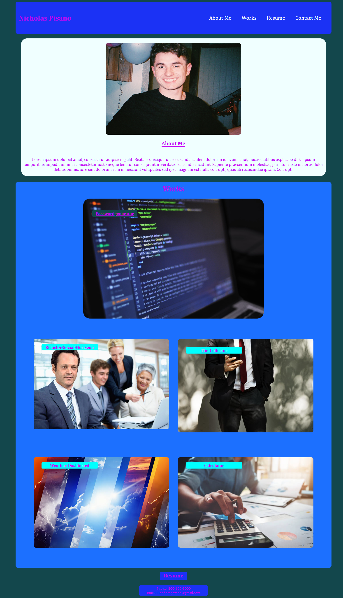

# Nicks-Portfolio

### Description:
This code is my portfolio website. This website shows my projects with links to  all my repos.A working navbar will help you scroll the page. This is still a work in progress with many to dos. The website is not the final product and could be completely different.

### Technology used:
1\. HTML  
2\. CSS

## To do List:
1\. Fix css and css images flexbox 
2\. Add more pseudo-classes
3\. Add screen media
4\. Add links for the works card

## Links:

[Link to Github Repo](https://github.com/Lekashi/Nicks-portfolio "Link to Github Repo")

[Link to Website](https://lekashi.github.io/Nicks-portfolio/ "Link to Website")

## Screenshot of the website

